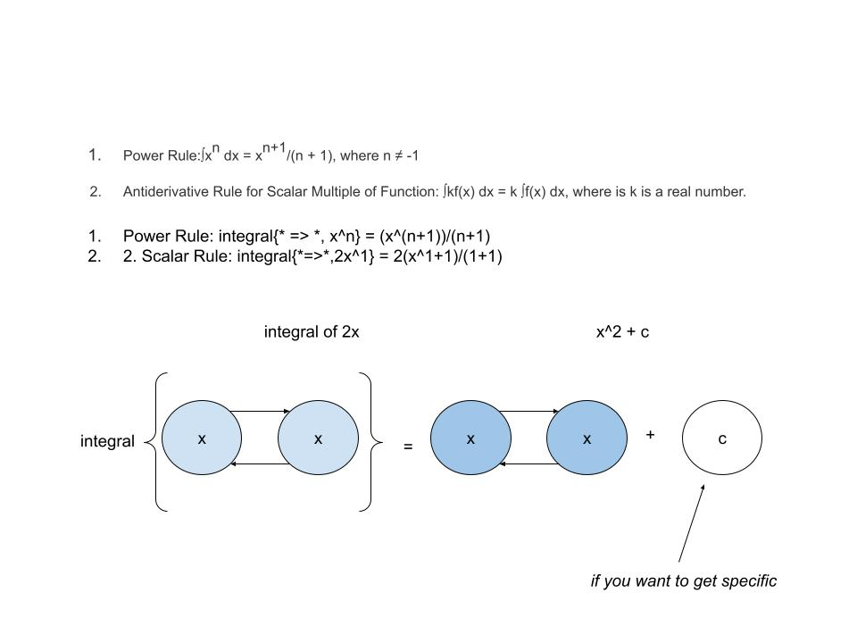
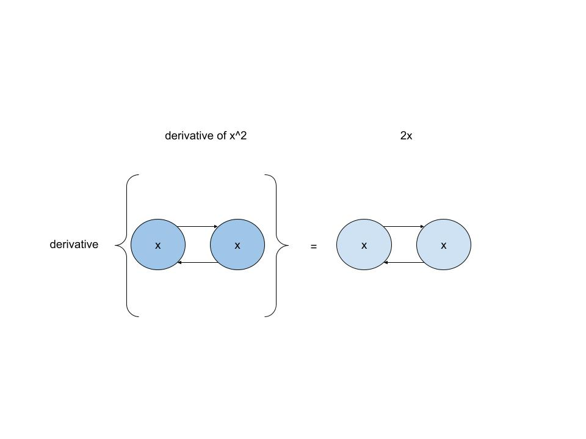
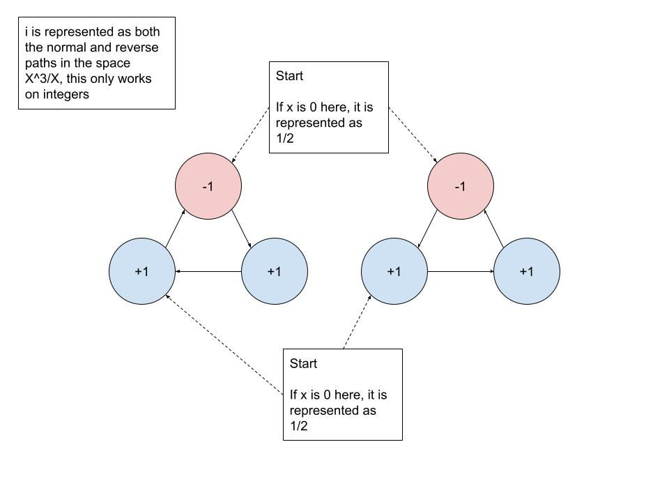

# Riemann Hypothesis

### 1. Integral



### 2. Derivative



### 3. X^3/X Halts



The following is a condensed decider that returns the result of the path.

-x + y + z = a\
-x + y + z = -a

a and -a represent the complex number, i

``` javascript
-x + y + z = a
function decider(x)
{
	while (x != 0)
	{
		// -x
		if (x > 0)
		{
			x--;
			if (x == 0)
			{
				return 1/2; // returns a and -a <=> i
			}

		}	

		// y
		if (x < 0)
		{
			x++;
			if (x == 0)
			{
				return 1/2; // returns a and -a <=> i
			}
		}

		// z
		if (x < 0)
		{
			x++;
			if (x == 0)
			{
				return 0; // returns a and -a <=> i
			}
		}
	}

	return 0; // returns a and -a <=> i
}
```

Next Problem:

What separates a whole number from a real number?

-----

### References

Ung, E. (2024). Topology Of Javascript. https://github.com/ericung/TopologyOfJavascript

Ung, E. (2024). Harmonic Monomial Deciders. https://github.com/ericung/HarmonicMonomialDeciders

Weisstein, E. W. (2021). Riemann hypothesis. Retrieved November 30, 2023, from https://mathworld.wolfram.com/RiemannHypothesis.html
